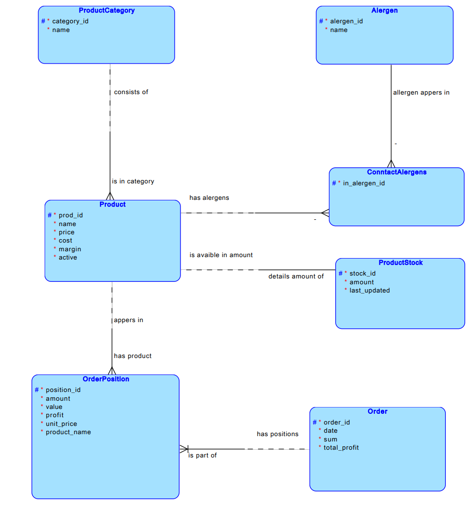
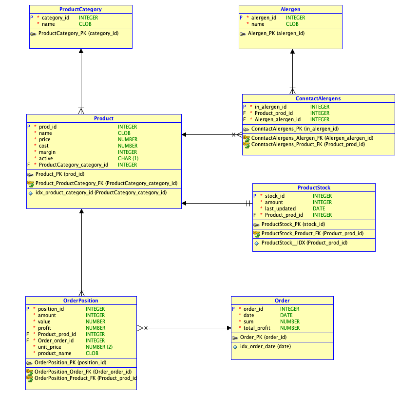

# PROJEKT - Aplikacja do obsługi Bufetu - BufetPW

Wykonali: Martyna Orzechowska, Mateusz Ogniewski, Joanna Jóśko, Filip Fijałkowski, Jakub Sikorski

## Dokumentacja projektowa

### Wstęp

Tematyką projektu jest prosta aplikacja bazodanowa przeznaczona do obsługi bufetu. Aplikacja składa się z części transakcyjnej dotyczącej realizacji zamówień wraz z aktualizacją stanu magazynowego oraz części analitycznej dotyczącej analizy sprzedaży i przychodów w wybranych okresach czasowych.

### Postawienie aplikacji

Na początku kopiujemy repozytorium:

```sh
git clone https://gitlab-stud.elka.pw.edu.pl/bd2-25l/bd2-25l-z19
cd bd2-25l-z19
```

Z racji zaprojektowanej przez nas dockeryzacji uruchomienie projektu jest banalnie proste - wystarczy wpisać na maszynie z włączonym dockerem, będąc w folderze głównym projektu, poniższą komende:

```sh
# za pierwszym razem lub po wprowadzeniu zmian w kodzie
./run_app --build
# przy każdym kolejnym uruchomieniu
./run_app
```

następnie odczekać chwilę na budowanie się aplikacji i jeżeli wszystko przebiegło zgodnie z planem to strona powinna być dostępna pod [localhost:3000](http://localhost:3000).
Po wejściu na stronę zostaniemy automatycznie poproszeni o zalogowanie. Możemy założyć własne konto, ale nie będzie ono posiadało uprawnień administratora. Aby zalogować się jako administrator musimy skorzystać z domyślnego konta admina a następujących danych logowania:

```sh
login: admin@gmail.com
hasło: Admin123.
```

**Uwaga** - jeżeli chcemy postawić aplikację "na poważnie" powinniśmy wejść w plik `.example_env` zmienić w nim wszystkie wrażliwe wartości wartości tj. `AUTH_SECRET` i `DB_PASSWORD`. Zmianie powinno także ulec hasło domyślnego admina, którego to hash trzymany jest w `/baza/skrypty_sql/seed.sql` na samej górze pliku. Po wprowadzeniu zmian musimy ponownie uruchomić powyższą komendę (`./run_app --build`).

### Technologie

Do stworzenia aplikacji skorzystaliśmy z następujących technologii:

<div style="display: flex; gap: 50px; max-width: 500px; flex-wrap: wrap; justify-content: center;">
  
  
  
  
  
  
  
  
  
  
  
  
  
  
  
  
</div>


### Opracowanie modelu pojęciowego (E-R)

Przy rozważaniach dotyczących modelowania bazy pominęliśmy celowo modelowanie użytkownika, ponieważ przy zakładanym przez nas dwupoziomowym poziomie uprawnień do aplikacji domyślny model użytkownika oferowany przez wybrane technologie ([Django](https://docs.djangoproject.com/en/5.2/topics/auth/default/), [AuthJS](https://authjs.dev/getting-started/database#models)) jest wystarczający oraz ułatwiło to dalszą implementację aplikacji.
Przy opracowaniu modelu pojęciowego skupiliśmy się na jak najdokładniejszym odwzorowaniu zależności występujących między obiektami w świecie rzeczywistym w modelu E-R. W związku z tym zdecydowaliśmy się odpowiednio na:

- Odseparowanie stanu magazynowego produktu jako osobą encję - bezpieczeństwo wykonywania transakcji przykładowo zmiana kategorii produktu w tym samym czasie co wykonywanie zamówienia nie przekształci błędnie stanu magazynu.
- Atrybut marży określa marże jaką może mieć właściciel bufetu ze względu na podpisane umowy z dostawcami. Pełni on rolę informacyjną a nie wyliczaną.
- Dodanie dodatkowego atrybutu encji produktu dot. czy dany produkt jest "aktywny". Pole to ma na celu umożliwienie wycofania np. produktu ze sprzedaży tak by nie był on widoczny np. dla kasjera, jednak została zachowana poprawna historia transakcji z tym produktem (usunięcie produktu mogłoby powodować zafałszowanie historii zamówień).
- Wykorzystanie encji słownikowych do kategorii produktów oraz alergenów - ręczne wprowadzanie kategorii oraz alergenów produktów po ich jest mało wygodne dla użytkownika aplikacji oraz umożliwiałoby wielokrotnie dodawanie tych samych danych wyrażonych innymi słowami np. _słodkie_ oraz _słodkości_ znaczą to samo czy _orzechy_ oraz _mieszanka orzechów_ są tym samym alergenem.
- W celu dalszego opracowywania modelu logicznego bazy relacja wiele-do-wielu produktów do alergenów została zastąpiona tabelą pośrednią.
- Model pojęciowy został również zgodnie z sugestią "uzupełniony" o zmiany wynikające z później przeprowadzonej denormalizacji w tabeli dot. pozycji zamówień.



### Opracowanie modelu logicznego

Na podstawie opracowanego modelu pojęciowego przystąpiliśmy do stworzenia modelu logicznego dla bazy relacyjnej. Dodatkow skorzystaliśmy z możliwości Data Modeler i określiliśmy w modelu dodatkowe indeksy mające na celu poprawę wydajności zapytań wykonywanych na bazie danych. Model również odzwierciedla późniejsze decyzje dotyczące denormalizacji tabel w bazie danych (tabela pozycji zamówień).



#### Denormalizacja

W celu optymalizacji zapytań do bazy danych podjęliśmy następujące decyzje:

- Dodanie kolumn pre-join dot. nazwy produktu w tabeli pozycji zamówienia. Kolumna ta jest uzupełniana przez trigger podczas operacji insert. Dodanie tej kolumny umożliwiło uproszczenia zapytania o dane zamówienie do wykorzystywania jednego złączenia zamiast dwóch.
- Dodanie kolumn wyliczanych do tabeli zamówienia oraz tabeli pozycji zamówienia. Wartości do tych tabel są wyliczane przy operacjach dodawania zamówienia na backendzie a następnie przekazywane w INSERT. Decyzja o wyliczaniu danych na backendzie wynika z możliwości automatycznego zwrotu informacji o stworzonym obiekcje na frontend aplikacji bez konieczności wykonywania dodatkowego zapytania na bazę w celu otrzymania informacji o nowo dodanym zamówieniu na bazę.

#### Indeksy

Poza domyślnymi indeksami na kluczach głównych oraz wartości unikalnych dodaliśmy dwa dodatkowe dwa indeksy mające na celu usprawnienie zapytań na zakładanych przez nas dużych tabelach.

- Indeks na kategorii produktu w tabeli produkty.
- Indeks na dacie w tabeli zamówień.

Ze względu na wybrany typ bazy danych (Postgres) typ indeksu jest automatycznie określany przez bazę. Również do momentu kiedy wyżej wymienionej tablice nie staną się "duże" silnik bazy danych będzie automatycznie korzystał z sekwencyjnego przeszukiwania wpisów w bazie.

### Widoki

W celu optymalizacji zapytań do części raportowej zostały opracowane dwa widoki:

- Widok dziennej sprzedaży, który przekazuje informację o: kwocie sprzedaży, liczbie zamówień, przychody - jest on wykorzystywany w panelu statystycznym w górnych 4 widgetach.
- Widok dziennej sprzedaży z podziałem na kategorie produktów, który informuje o liczbie sprzedanych produktów z danej kategorii, wartości sprzedaży oraz przychodów dla danej kategorii  - jest on zaimplementowany na bazie oraz z gotowymi endpointami, umożliwia to dalszy rozwój aplikacji (zgodnie z informacją od prowadzącego projekt był wystarczająco rozbudowany i nie musieliśmy implementować widoczności tych danych raportowych w widoku aplikacji).

### Widoki zmaterializowane

W celu optymalizacji zapytań do części raportowej zostały opracowane cztery widoki zmaterializowane:

- Widok historii stanu produktu na magazynie - widok przeznaczony głównie do analizy jak zmienia się stan magazynu na przestrzeni kolejnych dni. Dane z tego widoku są widoczne na wykresie w oknie produktu. Na tym widoku zostały założone dwa indeksy - jeden unikalny wymagany oraz index na połączeniu identyfikatora produktu oraz daty zapisu stanu magazynu.
- Widok historii dziennej sprzedaży na przestrzeni kolejnych dni - przekazuje te same informacje co zwykły widok dziennej sprzedaży, ale zachowuje historię kolejnych dni. Na widoku zostały zastosowane odpowiednio indeksy na dacie, zysku oraz liczbie zamówień w celu możliwości w przyszłości dalszej rozbudowy aplikacji o np. analizę rentowności bądź ruchu klientów w bufecie. Część informacji zapisanych w tym widoku są wykorzystywane do tworzenia wykresów widocznych w panelu statystycznym.
- Widok historii dziennej sprzedaży z podziałem na kategorie produktów na przestrzeni kolejnych dni, przekazuje te same informacje co widok dziennej sprzedaży z podziałem na kategorie produktów, ale zachowuje historię kolejnych dni.  Widok ma odpowiednio zastosowane wymagany unikalny indeks na numerze wpisu, indeks na połączeniu daty z kategorią produktu w celu optymalizacji zapytań. Widok ten został w pełni zaimplementowany na bazie oraz na backedzie, dalsza implementacja wizualizacji przechowywanym w nim danych na frontedzie nie została wykonana ze względu na informację o wystarczającym rozbudowaniu projektu od prowadzącego.
- Widok średniego ruchu klienckiego w poszczególnych dniach tygodnia o danych godzinach - widok przeznaczony do przyszłej analizy ruchu w bufecie umożliwiający np. określenie kiedy więcej pracowników bufetu powinno być na zmianie. Zastosowaliśmy indeks złożony na kolumnach dnia tygodnia oraz godzinie. Widok ten został w pełni zaimplementowany na bazie oraz na backedzie, dalsza implementacja wizualizacji przechowywanym w nim danych na frontedzie nie została wykonana ze względu na informację o wystarczającym rozbudowaniu projektu od prowadzącego.

W celu zapewnienia regularnego (codziennego) odświeżania widoków zdecydowaliśmy się na skorzystanie z rozszerzenia do bazy danych jakim jest pg_cron. Uruchomienie sekwencji równoległego odświeżania widoków została opisana w [pg_cron_setup.sql](baza/pg_cron_setup.sql).

### Funkcjonalności aplikacji

#### części operacyjnej (transakcyjnej)

Aplikacja rozróżnia obecnie dwa poziomy dostępu do aplikacji: dostęp na poziomie kasjera umożliwia tworzenie i składanie (również anulowanie) zamówień poprzez wybieranie produktów z listy. Całe zamówienie, widoczne na górze strony, zawiera listę wybranych produktów razem z ich wszystkimi danymi (ilość na stanie, alergeny, zamówione sztuki) oraz sumaryczną cenę za całe zamówienie.
Kasjer składający zamówienie ma wgląd do dokładnej liczby produktów na stanie, ich ceny oraz zawartych alergenów. Dla ułatwienia składania zamówienia i zwiększenia czytelności listy produkty zostały podzielone na kategorie: Batony, Owoce, Ciepłe Napoje, Zimne Napoje, Przekąski oraz Desery.
Dostęp na poziomie administratora umożliwia pełne zarządzanie produktami dostępnymi w serwisie. Każdy produkt można dowolnie modyfikować (nazwa, cena, marża, ilość na stanie, alergeny). Dodanie nowego produktu dzieje się poprzez skopiowanie istniejącego i zmianę jego danych tak, aby opisywał nowy (np zmiana danych Banana na Pomarańczę, inna nazwa i nieco wyższa cena). Całkowite usunięcie produktu nie jest możliwe w celu zachowania danych archiwalnych (stare zamówienia zawierają dane o usuniętym batonie, który nie istnieje już w bazie danych). Zamiast tego każdy produkt można "wyłączyć z obiegu". Będzie on nadal widoczny dla administratorów, ale nie będzie dostępny do kupienia w części odpowiedzialnej za składanie zamówień.

#### części analityczno-raportowej

Aplikacja oferuje podsumowania zysku i zamówień w postaci wartości liczbowych oraz wykresów z danego okresu czasu (ostatnie pół roku, 30 dni lub tydzień). Panel statystyczny, dostępny jedynie dla użytkownika posiadającego uprawnienia administratora serwisu, daje wgląd w funkcjonowanie bufetu na przestrzeni czasu. Patrząc na rozłożenie zamówień i zysków możemy obserwować trendy wzrostowe i spadkowe oraz potencjalnie dostosować działanie serwisu do zapotrzebowań klientów zależnie od miesiąca czy pory roku.

## Testowanie aplikacji

Przy testowaniu aplikacji korzystaliśmy z opracowanego skryptu wczytującego przykładowe dane, podglądu zawartości tabel dostępnym w pgAdminie oraz widoku narzędzi IDE Pycharm. Poprawność dostarczanych danych, sprawdzenie działania walidacji przekazywanych danych w żądaniach w przyszłości przez frontend dokonywaliśmy przy pomocy narzędzia Postman.  W celu kontroli poprawności tworzenia się wykresów stanu magazynowego produktu został opracowany skrypt *mock.sql*, który umożliwiał podgląd jak będą wyglądały wykresy przez wprowadzeniem automatycznego odświeżania. Również przeprowadziliśmy doświadczalne testy dot. wygody obsługi aplikacji przez osoby z poza projektu. Istotną kwestią, którą testowaliśmy również było sprawdzanie poprawności działania kontroli uprawnień użytkownika w zależności od przekazywanego tokenu JWE.
